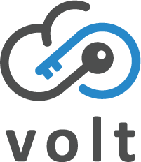

[![Contributors][contributors-shield]][contributors-url]
[![Stargazers][stars-shield]][stars-url]
[![Issues][issues-shield]][issues-url]
[![MIT License][license-shield]][license-url]


<br />
<p align="center">
  <a href="https://github.com/sebastiean/volt">
    
  </a>

  <!-- <h3 align="center">Volt</h3> -->

  <p align="center">
    An open source Azure Key Vault API compatible server (emulator).
    <br />
    <a href="https://github.com/sebastiean/volt/issues">Report Bug</a>
    ·
    <a href="https://github.com/sebastiean/volt/issues">Request Feature</a>
  </p>
</p>

> 🚨 This project is in **alpha** status. This means that bugs are extremely likely and no assurances are made about  compatability with the Key Vault REST API.

<details open="open">
  <summary>Table of Contents</summary>
  <ol>
    <li><a href="#about-the-project">About The Project</a></li>
    <li><a href="#getting-started">Getting Started</a></li>
    <li><a href="#usage">Usage</a></li>
    <li><a href="#roadmap">Roadmap</a></li>
    <li><a href="#contributing">Contributing</a></li>
    <li><a href="#license">License</a></li>
    <li><a href="#contact">Contact</a></li>
    <li><a href="#acknowledgements">Acknowledgements</a></li>
  </ol>
</details>

## About The Project

Volt is an open source Azure Key Vault API compatible server (emulator) based on Node.js and written in Typescript. 

Volt is inspired by and heavily based on [Azurite](https://github.com/Azure/Azurite), an Azure Storage API emulator. Volt uses (pretty much) the same architecture and patterns that are found in the Azurite project.

### Built With

* [Typescript](https://github.com/microsoft/TypeScript)
* [Express](https://github.com/expressjs/express)
* [AutoRest](https://github.com/Azure/autorest)

### Supported Features

* [Secrets API](https://docs.microsoft.com/en-us/rest/api/keyvault/#secret-operations)
  - [Set Secret](https://docs.microsoft.com/rest/api/keyvault/SetSecret)
  - [Update Secret](https://docs.microsoft.com/rest/api/keyvault/UpdateSecret)
  - [Get Secret](https://docs.microsoft.com/rest/api/keyvault/GetSecret)
  - [Get Secret Versions](https://docs.microsoft.com/rest/api/keyvault/GetSecretVersions)
  - [Get Secrets](https://docs.microsoft.com/rest/api/keyvault/GetSecrets)
  - [Delete Secret](https://docs.microsoft.com/rest/api/keyvault/DeleteSecret)
  - [Get Deleted Secret](https://docs.microsoft.com/rest/api/keyvault/GetDeletedSecret)
  - ~~[Get Deleted Secrets](https://docs.microsoft.com/rest/api/keyvault/GetDeletedSecrets)~~ *Not yet supported
  - ~~[Backup Secret](https://docs.microsoft.com/rest/api/keyvault/BackupSecret)~~ *Not yet supported
  - ~~[Purge Deleted Secret](https://docs.microsoft.com/rest/api/keyvault/PurgeDeletedSecret)~~ *Not yet supported
  - ~~[Recover Deleted Secret](https://docs.microsoft.com/rest/api/keyvault/RecoverDeletedSecret)~~ *Not yet supported
  - ~~[Restore Secret](https://docs.microsoft.com/rest/api/keyvault/RestoreSecret)~~ *Not yet supported


## Getting Started

Install / run using one of the following options:

### Clone this repo

After cloning source code, execute following commands to install and start Volt.

```bash
npm ci
npm run build
npm install -g
volt [options]
```

### [DockerHub](https://hub.docker.com/r/sebastiean/volt)

#### Run Volt docker image

```bash
docker run -p 13000:13000 sebastiean/volt
```

`-p 13000:13000` will expose secrets service default listening port.

#### Run Volt docker image with customized persisted data location

```bash
docker run -p 13000:13000 -v ~/volt:/data sebastiean/volt
```

`-v ~/volt:/data` will use and map host path `~/volt` as Volt's workspace location.

#### Customize other Volt supported parameters for docker image

```bash
docker run -p 8888:8888 -v ~/volt:/data sebastiean/volt volt -l --secretsPort 8888 --secretsHost 0.0.0.0 --loose --skipApiVersionCheck --cert ./localhost.cert --key ./localhost.key --oauth basic 
```


## Usage

### SDK

To use Volt with the Azure Key Vault SDKs, you <ins>must</ins> enable [HTTPS](#certificate-options-https) and [OAuth](#oauth-options).

```bash
volt --oauth basic --cert certname.pem --key certname-key.pem
```

#### Example (JavaScript SDK):

```js
const { DefaultAzureCredential } = require("@azure/identity");
const { SecretClient } = require("@azure/keyvault-secrets");

const credential = new DefaultAzureCredential();
         
const url = `https://127.0.0.1:13000`;

const client = new SecretClient(url, credential);
```

### Command line options

#### Standard options

| Option                      	| Example                 	| Description                                                                                                                                                           	|
|-----------------------------	|-------------------------	|-----------------------------------------------------------------------------------------------------------------------------------------------------------------------	|
| --secretsHost <host>        	| --secretsHost 127.0.0.1 	| Listening host. By default Volt secrets will listen on 127.0.0.1<br>Use 0.0.0.0 to accept requests from remote addresses (unsafe).                                    	|
| ---secretsPort <port>       	| --secretsPort 8888      	| Listening port. By default, Volt will listen on port 13000 for secrets. <br>Customize the listening port per your requirements.                                       	|
| -s<br>---silent             	|                         	| Disable access logs. By default Volt will display access logs in the console.                                                                                         	|
| -d <path><br>--debug <path> 	| -d ./debug.log          	| Debug log includes detailed information on every request and exception stack traces.<br>Enable it by providing a valid local file path for the debug log destination. 	|
| -L<br>--loose               	|                         	| By default Volt will apply strict mode. Strict mode will block unsupported request headers or parameters.<br>Disable it by enabling loose mode.                       	|

#### Certificate options (HTTPS)

Please see [HTTPS Setup](#https-setup) section for help with creating self-signed certificates to use with Volt.

| Option                	| Example                	| Description                                                                                                       	|
|-----------------------	|------------------------	|-------------------------------------------------------------------------------------------------------------------	|
| --cert                	| --cert path/server.pem 	| By default Volt will listen on HTTP protocol.<br>Provide a PEM or PFX certificate file path to enable HTTPS mode. 	|
| --key                 	| --key path/key.pem     	| When --cert is provided for a PEM file, must provide corresponding --key.                                         	|
| --pwd                 	| --pwd pfxpassword      	| When --cert is provided for a PFX file, must provide corresponding --pwd.                                         	|

#### OAuth options

| Option (with example) 	| Example       	| Description                                                             	|
|-----------------------	|---------------	|-------------------------------------------------------------------------	|
| --oauth               	| --oauth basic 	| Enable OAuth authentication for Volt. Requires HTTPS to be enabled too. 	|

Currently, Volt supports following OAuth authentication levels:

**Basic**

In basic level, `--oauth basic`, Volt will do basic authentication, such as validating incoming bearer token, checking issuer, audience, expiry.   
<ins>Volt will NOT verify the token signature or permission</ins>.

#### Key Vault specific options

These options can be used to change the [soft-delete](https://docs.microsoft.com/en-us/azure/key-vault/general/soft-delete-overview) behaviour of Volt. Please see the linked official documentation to understand this feature.

| Option                  	| Example              	| Description                                                                                                                   	|
|-------------------------	|----------------------	|-------------------------------------------------------------------------------------------------------------------------------	|
| --disableSoftDelete     	|                      	| Disable the soft-delete feature entirely.<br>See https://docs.microsoft.com/en-us/azure/key-vault/general/soft-delete-change  	|
| --recoverableDays       	| --recoverableDays 10 	| Number of calendar days deleted vault objects remain in a recoverable state.<br>Should be between 7 and 90.<br>Default is 90. 	|
| --purgeProtection       	|                      	| If enabled, deleted vault objects cannot be purged during the retention period.                                               	|
| --protectedSubscription 	|                      	| If enabled, Volt will behave as if part of a subscription that cannot be cancelled.                                           	|

### HTTPS Setup

> This section is borrowed almost directly from Azurite

Volt natively supports HTTPS with self-signed certificates via the `--cert` and `--key`/`--pwd` options. You have two certificate type options: PEM or PFX. PEM certificates are split into "cert" and "key" files. A PFX certificate is a single file that can be assigned a password.

#### PEM

##### Generate PEM Certificate and Key

You have a few options to generate PEM certificate and key files. We'll show you how to use [mkcert](https://github.com/FiloSottile/mkcert) and [OpenSSL](https://www.openssl.org/).

###### mkcert

[mkcert](https://github.com/FiloSottile/mkcert) is a utility that makes the entire self-signed certificate process much easier because it wraps a lot of the complex commands that you need to manually execute with other utilities.

**Generate Certificate and Key with mkcert**

1. Install mkcert: https://github.com/FiloSottile/mkcert#installation.
2. Run the following commands to install the Root CA and generate a cert for Volt.

```bash
mkcert -install
mkcert 127.0.0.1
```

That will create two files. A certificate file: `127.0.0.1.pem` and a key file: `127.0.0.1-key.pem`.

**Start Volt with HTTPS and PEM**

Then you start Volt with that cert and key.

```bash
volt --cert 127.0.0.1.pem --key 127.0.0.1-key.pem
```

NOTE: If you are using the Azure SDKs, then you will also need to pass the `--oauth basic` option.

###### OpenSSL

[OpenSSL](https://www.openssl.org/) is a TLS/SSL toolkit. You can use it to generate certificates. It is more involved than mkcert, but has more options.

**Install OpenSSL on Windows**

1. Download and install the OpenSSL v1.1.1a+ EXE from http://slproweb.com/products/Win32OpenSSL.html
2. Set the following environment variables

```bash
set OPENSSL_CONF=c:\OpenSSL-Win32\bin\openssl.cfg
set Path=%PATH%;c:\OpenSSL-Win32\bin
```

**Generate Certificate and Key**

Execute the following command to generate a cert and key with [OpenSSL](https://www.openssl.org/).

```bash
openssl req -newkey rsa:2048 -x509 -nodes -keyout key.pem -new -out cert.pem -sha256 -days 365 -addext "subjectAltName=IP:127.0.0.1" -subj "/C=CO/ST=ST/L=LO/O=OR/OU=OU/CN=CN"
```

The `-subj` values are required, but do not have to be valid. The `subjectAltName` must contain the Volt IP address.

**Add Certificate to Trusted Root Store**

You then need to add that certificate to the Trusted Root Certification Authorities. This is required to work with Azure SDKs and Storage Explorer.

Here's how to do that on Windows:

```bash
certutil –addstore -enterprise –f "Root" cert.pem
```

##### Start Volt with HTTPS and PEM

Then you start Volt with that cert and key.

```bash
volt --cert cert.pem --key key.pem
```

NOTE: If you are using the Azure SDKs, then you will also need to pass the `--oauth basic` option.

#### PFX

##### Generate PFX Certificate

You first need to generate a PFX file to use with Volt.

You can use the following command to generate a PFX file with `dotnet dev-certs`, which is installed with the [.NET Core SDK](https://dotnet.microsoft.com/download).

```bash
dotnet dev-certs https --trust -ep cert.pfx -p <password>
```

##### Start Volt with HTTPS and PFX

Then you start Volt with that cert and key.

```bash
volt --cert cert.pem --key key.pem
```

## Roadmap

See the [open issues](https://github.com/sebastiean/volt/issues) for a list of proposed features (and known issues).


## Contributing

Contributions are what make the open source community such an amazing place to be learn, inspire, and create. Any contributions you make are **greatly appreciated**.

1. Fork the Project
2. Create your Feature Branch (`git checkout -b feature/AmazingFeature`)
3. Commit your Changes (`git commit -m 'Add some AmazingFeature'`)
4. Push to the Branch (`git push origin feature/AmazingFeature`)
5. Open a Pull Request


## License

Distributed under the MIT License. See [LICENSE](/LICENSE) for more information.


## Contact

Sebastian Gatti - [sebastiean.gatti@gmail.com](mailto:sebastiean.gatti@gmail.com)

Project Link: [https://github.com/sebastiean/volt](https://github.com/sebastiean/volt)


## Acknowledgements
* [Azurite](https://github.com/Azure/Azurite)
* Logo design by [ch.iordanis](https://iordanisch.github.io/ch.iordanis)


[contributors-shield]: https://img.shields.io/github/contributors/sebastiean/volt.svg
[contributors-url]: https://github.com/sebastiean/volt/graphs/contributors
[stars-shield]: https://img.shields.io/github/stars/sebastiean/volt.svg
[stars-url]: https://github.com/sebastiean/volt/stargazers
[issues-shield]: https://img.shields.io/github/issues/sebastiean/volt.svg
[issues-url]: https://github.com/sebastiean/volt/issues
[license-shield]: https://img.shields.io/github/license/sebastiean/volt.svg
[license-url]: https://github.com/sebastiean/volt/blob/main/LICENSE